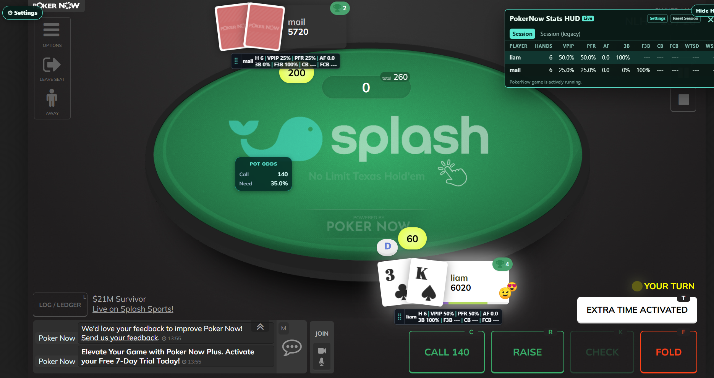
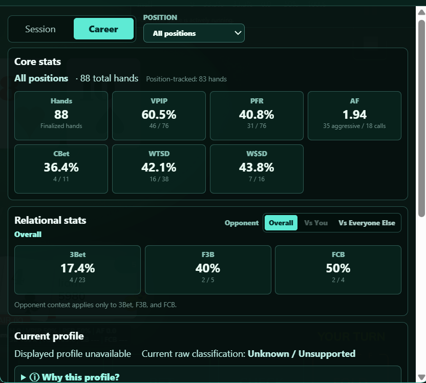
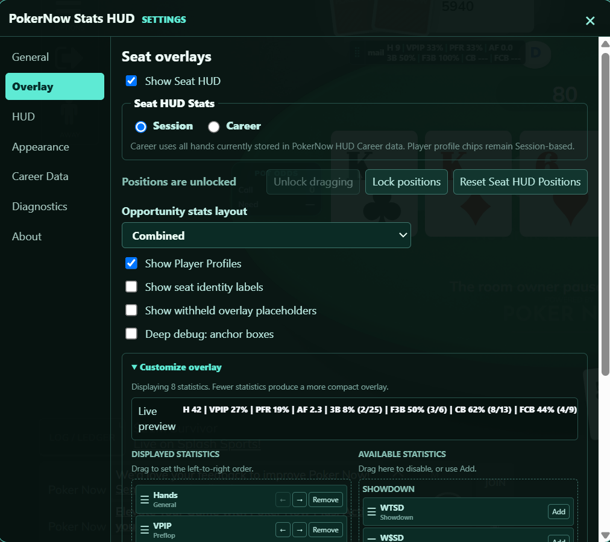

# PokerNow Stats HUD

PokerNow Stats HUD is a Chrome extension that turns observed PokerNow hands into a real-time, configurable player-statistics overlay with persistent Session and Career history.

**Version 1.1.0**

## Demo



*The live table view combines per-seat finalized-hand statistics, a compact leaderboard, and in-hand Pot Odds without covering the core table controls.*

### Career dashboard and opponent context



*The dashboard exposes persistent Career samples, WTSD/W$SD showdown results, and relational 3Bet, F3B, and FCB statistics with opponent-context filtering.*

### Configurable Seat HUD



*HUD Settings provides Session/Career source selection, draggable overlay controls, statistic ordering, visibility choices, and an immediate live preview.*

## Key features

- Real-time player statistics calculated from finalized hands, including VPIP, PFR, aggression factor, 3Bet/F3B, flop CBet/FCB, WTSD, and W$SD.
- Separate Session history and persistent local Career history for cross-session tracking.
- Hand-state, lifecycle, position, action-opportunity, and showdown inference with conservative handling of incomplete evidence.
- Player dashboards with sample counts, position and opponent-context filters, notes, and profile evidence.
- In-hand Pot Odds showing call cost, eligible pot, and required equity.
- Configurable Seat HUD, leaderboard, statistic ordering, display modes, and draggable persistent overlays.

## How it works

```text
PokerNow game events
  → Manifest V3 MAIN-world bridge
  → event normalization, hand-state inference, and exactly-once finalization
  → Session storage + separate IndexedDB Career contributions
  → Seat HUD, leaderboard, player dashboard, profiles, and Pot Odds
```

The extension observes PokerNow's existing WebSocket event stream and builds statistics from hands it observes while active. Statistics are attached only after a supported hand is finalized, so the active hand does not prematurely affect displayed totals.

Session and Career persistence remain separate, and no extension-controlled external server is used.

## Installation

### Load from source

1. Download or clone this repository into a stable directory with `manifest.json` at its root.
2. Open `chrome://extensions` in desktop Chrome.
3. Enable **Developer mode**.
4. Select **Load unpacked** and choose the repository directory.
5. Open or reload a PokerNow game page.

### Install from a release ZIP

If a GitHub Release includes `pokernow-hud-v1.1.0.zip`, extract the ZIP first and load the extracted directory through **Load unpacked**.

Chrome does not load the ZIP directly.

Keep only one copy of the extension enabled at a time. Export a Career backup before replacing an existing installation, since uninstalling the extension or clearing its data can remove locally stored history.

## Testing

The public release passes **189 behavioral test files** plus a separate **release integrity suite**, covering hand inference, statistics, persistence, dashboards, overlays, Pot Odds, and release packaging.

```powershell
node runTests.js full
node runTests.js release
node scripts/release.js validate
```

No npm installation or third-party test dependency is required.

See [Testing](TESTING.md) for additional details.

## Privacy, limitations, and non-affiliation

- Runtime Session and Career data stay in the browser's extension storage.
- Public test fixtures are privacy-sanitized, de-identified behavioral fixtures derived from captured event shapes. Identifying player, game, session, hand, URL, timestamp, and account data has been removed or replaced.
- Career tracking begins when the extension observes accepted hands; it does not backfill earlier PokerNow history.
- Incomplete or ambiguous evidence can cause a statistic opportunity to be withheld rather than guessed.
- This independent project is not affiliated with, endorsed by, or maintained by PokerNow.

See [Privacy](PRIVACY.md) and [Known Limitations](KNOWN_LIMITATIONS.md) for additional details.

## AI-assisted development

This project was developed with substantial assistance from OpenAI Codex. I directed the product, selected features and behavior, reproduced and prioritized defects, tested the extension in live PokerNow sessions, validated fixes, and set acceptance criteria. Codex assisted substantially with implementation, testing, refactoring, and documentation.

The project reflects a human-directed, AI-assisted engineering workflow focused on iterative development, validation, and product decision-making.

## Technical documentation

- [Architecture](ARCHITECTURE.md) — runtime boundaries, ownership, data flow, and packaging.
- [Statistics support](STAT_SUPPORT.md) and [Statistics design](STATISTICS_DESIGN.md) — definitions, evidence requirements, reducers, and exclusions.
- [Semantic hand ledger](SEMANTIC_HAND_LEDGER.md) — normalized finalized-hand model and reducer boundary.
- [Career Data](CAREER_DATA.md) — local persistence, aggregation, backup, and restore behavior.
- [BoardCompanion layout](BOARD_COMPANION_LAYOUT.md) — stable table-local geometry used by Pot Odds.
- [Testing](TESTING.md), [Release audit](RELEASE_AUDIT.md), and [Changelog](CHANGELOG.md) — validation scope and release history.
